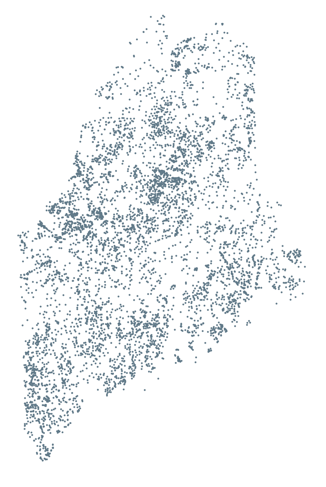

# MIDAS

MIDAS stands for "Maine Information Display Analys System" and a unique MIDAS string identifier is assigned to all of Maine's inland water.

Every time I try to find this metadata I end up spending way too much time, so I am making this available mostly to help me keep my sanity, but it may help others as well.

## Details

Geometry: POINT (EPSG:4326) &mdash; lake/pond/etc centroid

Fields: `name` (lake/pond/etc name; &lt;chr&gt;), `midas` (MIDAS identifier; &lt;chr&gt;)

## Formats

- `shp/`: ESRI Shapefile (POINT geom)
- `midas.csv`: Plain ol' CSV with X & Y
- `midas.geojson`: GeoJSON (POINT geom)
- `midas.sqlite`: Spatial-ops compatible SQLite; `midas` table (POINT geom)

